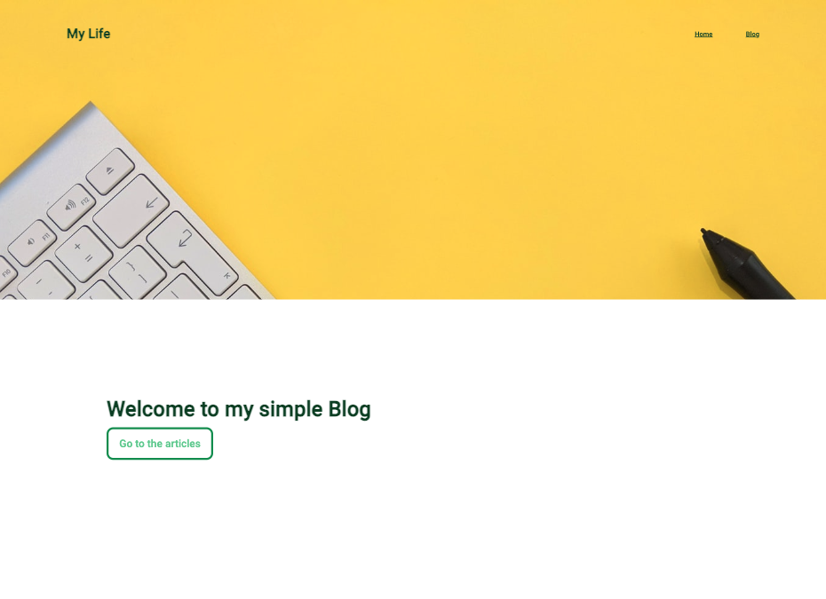

# Simple React Blog (Dynamical reendering)

Highlight: dynamic rendering through parameters with the `react-router-dom`

# Dynamical Render of Detail Page:

1 - in App use one Parameter, in this Repository for example I used this name `:idArticle` in my path. You can choose what you want `:yourParameterName`.

```jsx
import { BrowserRouter, Routes, Route } from "react-router-dom";
import "./App.scss";
import Home from "./pages/Home";
import Blog from "./pages/Blog";
import Article from "./pages/Article";

function App() {
  return (
    <>
      <BrowserRouter>
        <Routes>
          <Route path="/" element={<Home />}></Route>
          <Route path="/blog" element={<Blog />}></Route>
     {//⬇️ Here below ⬇️}
          <Route path="/blog/article/:idArticle" element={<Article />}></Route>
        </Routes>
      </BrowserRouter>
    </>
  );
}

export default App;
```

2 - I extract this parameter in the element that I need (in my case Article). Import {useParams} and put in your Component:

```jsx
import Header from "../component/Header/Header";
import { blogData } from "../db/blogdata";
import Detail from "../component/Detail/Detail";
//⬇️ Here below ⬇️
import { useParams } from "react-router-dom";
import "./Article.scss";

const Article = () => {
  //⬇️ Here below ⬇️
  const { idArticle } = useParams();

  // Search in your data search the Object (articleDetail here) with the same id

  const articleDetail = blogData.find(
    (article) => article.id === Number(idArticle)
  );

  if (!articleDetail) {
    return <div>Article not found</div>;
  }

  // You can use the properties of the found object (articleDetail here) and give them to your component.

  return (
    <>
      <Header />
      <div className="article-wrapper">
        <Detail
          url={articleDetail.img_url}
          title={articleDetail.title}
          date={articleDetail.published_date}
          text={articleDetail.description}
          author={articleDetail.author}
        />
      </div>
    </>
  );
};

export default Article;
```

# How to set it up

Clone this repository

Install all dependencies: `npm install`

Run app in dev mode: npm run dev

Open your localhost

# Used

npm install

npm install react-router-dom

npm install -D sass

npm i prop-types

<div>




</div>
